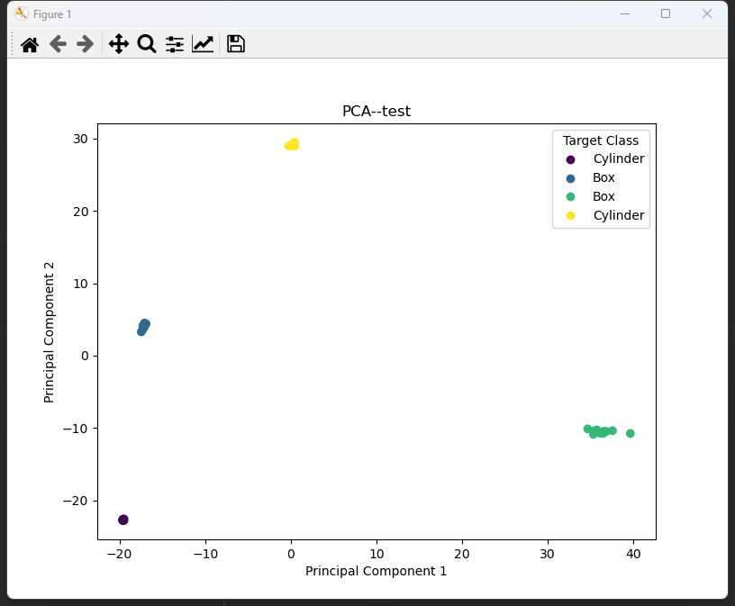
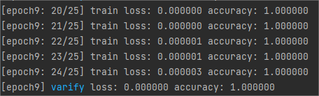

Report

by Nemo

2023.8.16

### 数据集
使用CloudCompare生成  
总共4个类别：立方体，球体，圆柱体，圆锥  
200采样点，采样位于表面  
训练集：每个类别50个数据  
验证集：每个类别10个数据  
测试集：每个类别10个数据  
数据样式：  
  
训练只采用前三列，即x,y,z值

### 项目
由于之前已经读过pointnet论文，所以直接写代码  
参考代码：https://github.com/fxia22/pointnet.pytorch  
实现思路：model.py中定义pointnet网络框架，dataset.py中处理数据集，train.py中训练  
参数：
- batchSize 8
- npoint 160
- epoch 10 
> npoint是每个数据中选取点的数量，由于生成的数据采样点不是严格的200，在170~220左右浮动，所以选取npoint=160；因此每个数据都会剔除些许的点使最后点的数量都为160，剔除方式为随机剔除

  
最后损失（nll_loss）：0.077，可以发现已经收敛

  
最后准确率：1.0  

### 实验
#### 使用PCA将特征降维并可视化，观察4个类别对应的特征（PCA.py）
使用训练好的模型中的特征提取器，对训练集、验证集、测试集中每个样例提取到1024维的特征，将这个特征使用PCA降至2维，并画出散点图  
训练集：

验证集：

测试集：

可以发现，降维后4个类别的特征聚在一起，说明每个类别有比较明显的特征，且模型的特征提取是有效的

#### 取消BatchNormalization
  
准确率不变，loss反而变小了，这个非常有趣

#### 取消学习率调整
  
虽然准确率无变化，但是loss变高了，说明学习率调整可以优化模型

#### 将Adam算法改为SGD
  
可以明显感知学习速率提高（读条变快了很多），但loss变高很多  
说明Adam算法性能要好一些，但是训练速度会慢一些

#### 取消学习率调整，并修改learning rate
SGD
- lr = 0.3，loss大幅提高，准确率降为0.75

- lr = 0.5，loss大幅提高，准确率降为0.5

- lr = 0.0001，loss小幅提高，准确率降为0.9

- lr = 0.00001，loss巨幅提高，准确率降为0.55

Adam
- lr = 0.3，loss大幅提高，准确率降为0.75

- lr = 0.5，loss巨幅提高，准确率降为0.45

- lr = 0.0001，loss小幅提高，准确率无变化

- lr = 0.00001，loss小幅提高，准确率无变化

> ps：每次训练准确率有所不同，我是roll了很多次取众数的  
> 看来SGD在学习率过大或过小时表现都不好，Adam在学习率过大时表现不好，在过小时表现仍然挺不错

#### 取消TransformNet
  
loss基本不变，准确率无变化  
可能是数据集的样本量过小的原因